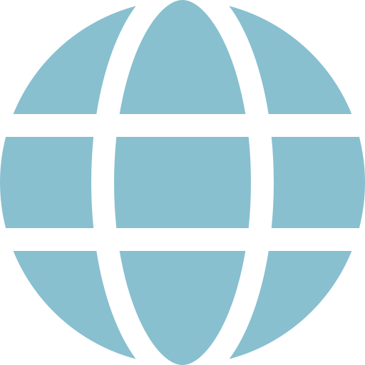
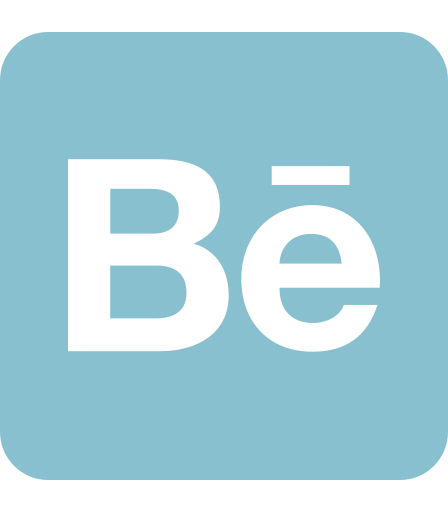
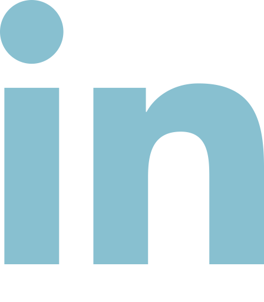

# **_Hello, I'm Ben White_**

A fullstack developer mainly working with `Typescript`, `React` and `NextJS` for creating web apps. I'm also pretty interested in creative coding and visual processing, so a lot of my personal repos are focused around that and generally use one of vanilla canvas, `Processing` or `ThreeJS`.

Aside from code and visual arts my other interests are really good music and, in as much downtime as modern living permits, reading &ndash; mostly greek philospopy and some physics. Though I don't comprehened large parts of either I continue to be fascinated by the ideas.

I always liked this small piece of a larger quote from Charles Eames of Bauhaus fame, **_"eventually everything connects"_**. I have kind of carried that around with me for years.

---

 
&nbsp;
&nbsp;&nbsp;&nbsp;&nbsp;&nbsp;&nbsp;
